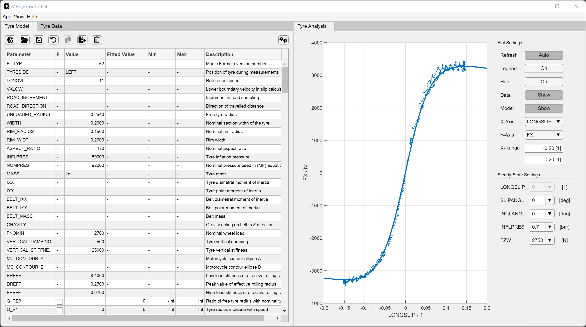

# Changelog

- Buttons in "Tyre Model"-Tab now resize if window width is too small
  (no text shown)
- New feature: view analysis tab on the right and activate "Auto-Refresh" to
  see changes to parameters directly in your plot
  14
- More minor bug fixes, improvements