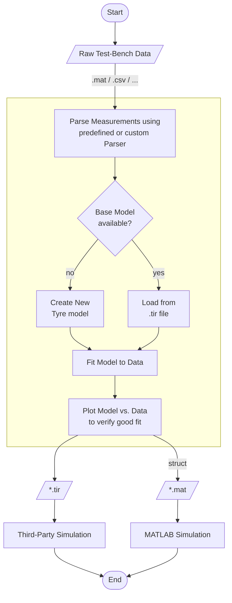
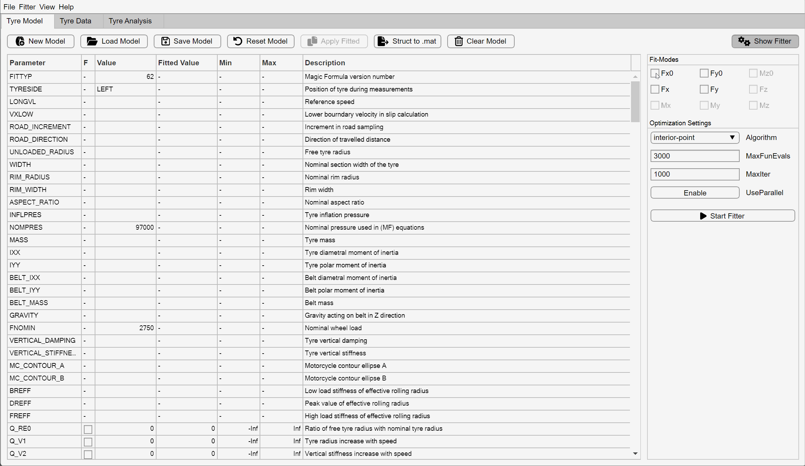
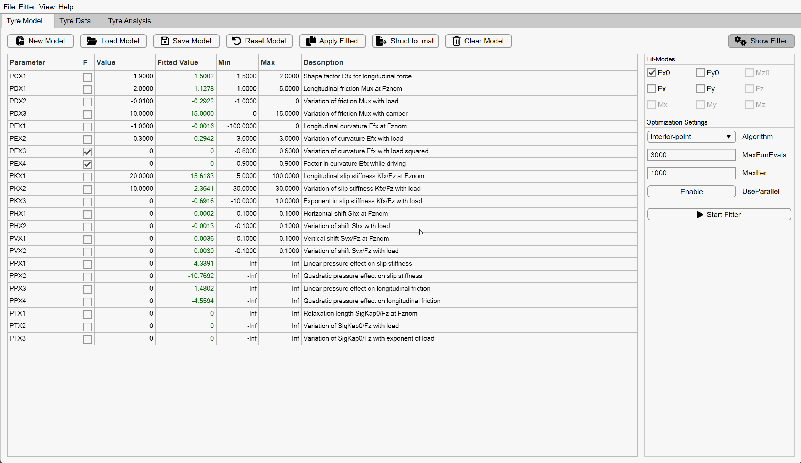
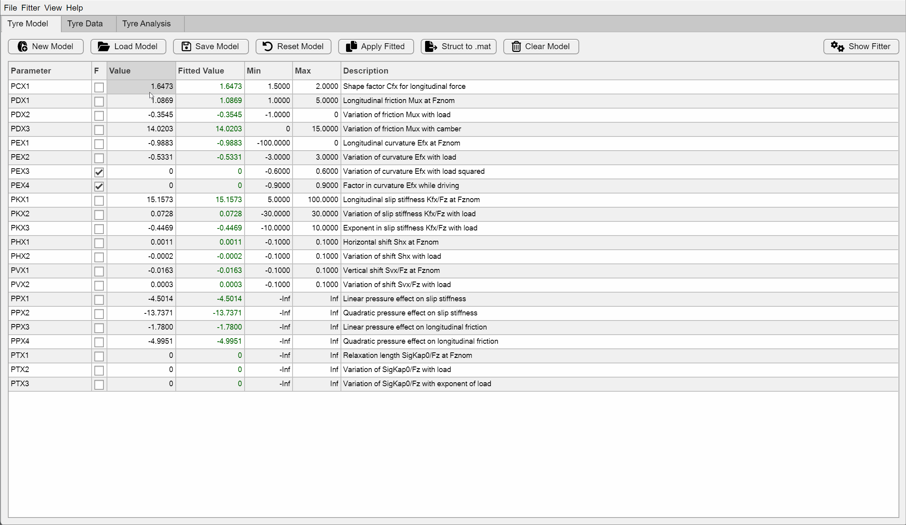
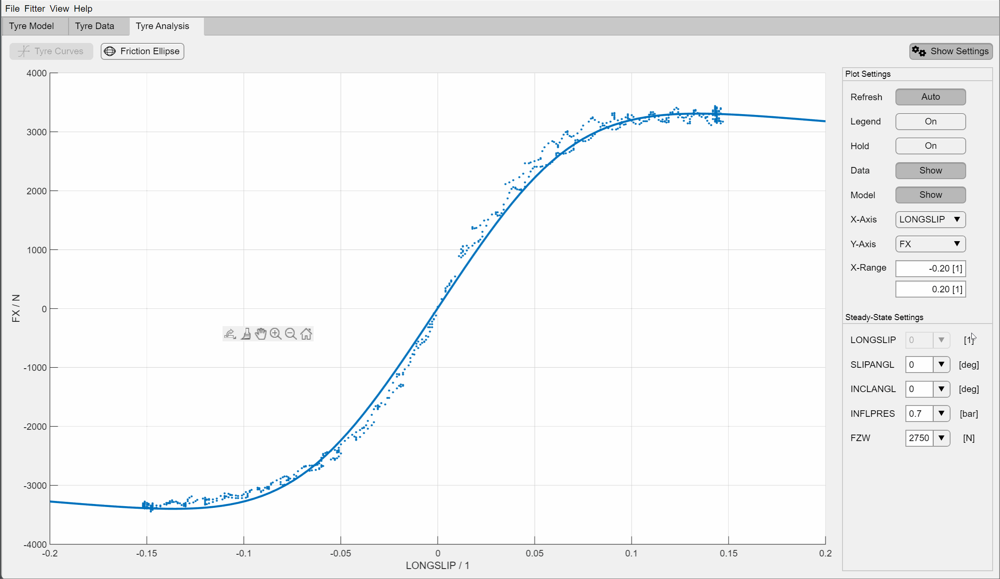

# Magic Formula Tyre Tool

- Interactively fit Magic Formula tyre models to data
- Automatically separate timeseries data into steady-state conditions
- Compare model outputs visually against data
- Load/Save models from/to `.tir` (Tyre Property File)
- Export fitted models parameters as `struct`

This project uses the model functions provided by the
[Magic Formula Tyre Library](https://github.com/teasit/magic-formula-tyre-library).
You can export the model parameters to use with said library to simulate tyre behavior in
MATLAB or create models suitable for code-generation in Simulink.

## Motivation

This project originates in my work as a Formula Student member of
[UPBracing](https://formulastudent.uni-paderborn.de/), where we required
computationally efficient but precise tire models suitable for code-generation.
Especially students in Formula Student / Formula SAE who want to model their tires for
control and estimation algorithms or simply for the purpose of better understanding might
benefit from this tool.

This project would not have been possible without the data provided by the
[Formula SAE Tire Test Consortium (FSAE TTC)](https://www.millikenresearch.com/fsaettc.html)
and the
[Calspan Tire Testing Research Facility (TIRF)](https://calspan.com/automotive/fsae-ttc).
De-identified and obscured test data has been used in examples and images or recordings
of the application, to conform to the
[license agreement](https://www.millikenresearch.com/FSAE_TTC_agreement.pdf).
Special thanks to Dr. Edward M. Kasprzak for granting me permission to provide the used,
de-identified and obscured data for demonstration purposes.

## Requirements

- MATLAB Base (tested with R2021a)
- Optimization Toolbox (for fitting)
- Signal Processing Toolbox (for raw measurement import)

## Installation

There are several ways:

- Download latest Release from [MATLAB File Exchange](https://de.mathworks.com/matlabcentral/fileexchange/111375)
- Download latest Release from [GitHub](https://github.com/teasit/magic-formula-tyre-tool/releases)
- Clone using Git and integrate into your projects using a [Project Reference](https://de.mathworks.com/help/simulink/ug/add-or-remove-a-reference-to-another-project.html)

## Usage

The core workflows are summarized in this flowchart:

[^TYDEX-KIT]: https://www.fast.kit.edu/download/DownloadsFahrzeugtechnik/TY100531_TYDEX_V1_3.pdf
[^Paper-TNO]: https://www.tandfonline.com/doi/full/10.1080/00423110500109299?scroll=top&needAccess=true

### Import Test-Bench Data

To import test-bench data, you might have to create a custom parser which takes and
arbitrary input file and converts it into an array of `tydex.Measurement` objects. Each
measurement object contains data for only one steady-state condition. This means that only
one variable is *sweeped* (= *transient*). In case of Formula SAE Tire Test Consortium Data,
two parsers for *Cornering* and *Drive/Brake* MAT files in SI-units are already available.

### Fit Model to Data

You can interactively fit your Magic Formula tire model to measured test-bench data.
Interactively means, you can cancel the fitting process at any point. The last iteration
will be saved and you can compare the fitted values to the current model values in a
table. You can then choose to append these values to your model.

### Manual Model Editing

You can manually edit the model values in the table. When using the Auto-Refresh feature,
the plot updates automatically to reflect your changes. This helps to get an intuition on
the effects of different parameter values.

### Plot Model against Data

To make sure the fitting process yields a plausible result, you can compare the test-bench
data to your fitted model. If the import process of the measurements worked correctly,
you will be able to select steady-state values from the dropdowns and thereby filter the
data. The Magic Formula tire model will then be supplied with the measured inputs for an exact
comparison.

## Known Issues

- Currently only Fitting of Fx0, Fy0, Fx, Fy is supported
- Only Magic Formula version 6.1.2 (62) is supported.
- The FSAE TTC parsers might not always work. You might have to create your own parser.
